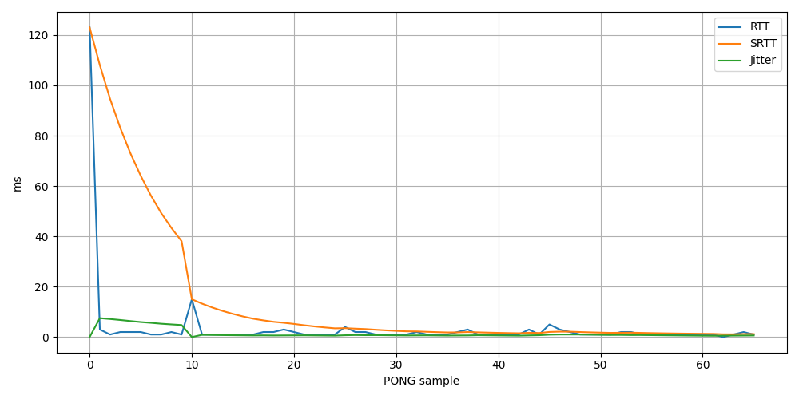

## Результаты

| Сценарий | Sent | Received | Lost | Dup | Late | LossRate | SRTT ms | Jitter ms |
|---|---:|---:|---:|---:|---:|---:|---:|---:|
| localhost, 60 с, интервал 1000 мс | 60 | 60 | 0 | 0 | 0 | 0.00 % | ≈40 | ≈5 |
| localhost, 30 с, интервал 500 мс  | 60 | 60 | 0 | 0 | 0 | 0.00 % | ≈40 | ≈5 |

## Наблюдения
- Первый RTT = 123 мс — прогрев сокета / JIT.
- SRTT быстро сходится к ~40 мс.
- Jitter стабилизируется на ~5 мс.
- Потерь на localhost нет.

## Графики

## Выводы
- PING/PONG работает корректно, классификация duplicate/late/unknown проверена юнит-тестами.
- На localhost сеть не вносит вклада — вся задержка от планировщика и таймера (Task.Delay 1000 мс + ReceiveAsync).
- Метрика LossRate чувствительна к таймауту: при interval=1000 мс таймаут 500 мс даёт 0 % потерь, а при interval=100 мс и той же нагрузке может давать ложные срабатывания — это стоит отметить в выводах.